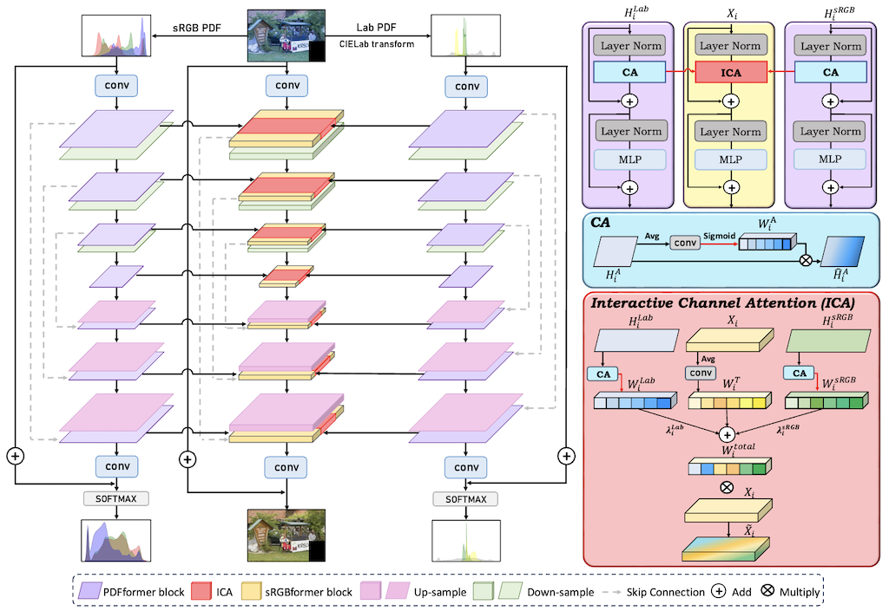
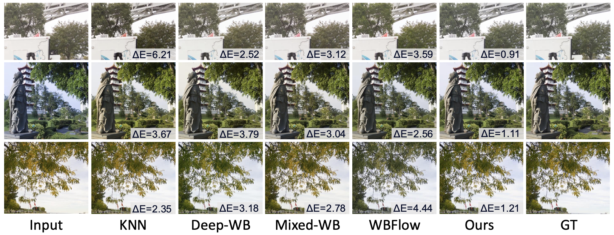
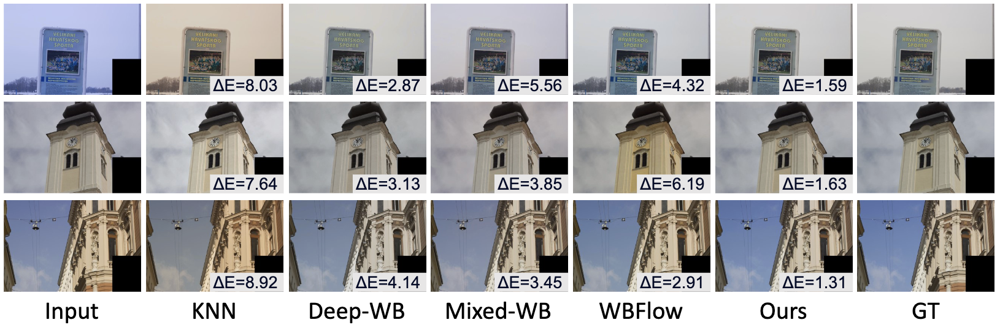
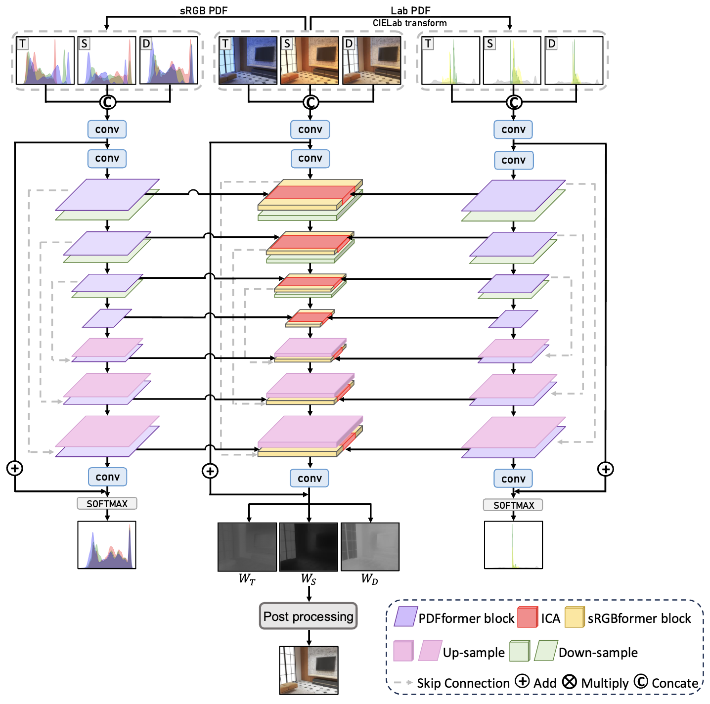

# ABC-Former: Auxiliary Bimodal Cross-domain Transformer with Interactive Channel Attention for White Balance, CVPR 2025.
Pytorch Implementation of "ABC-Former: Auxiliary Bimodal Cross-domain Transformer with Interactive Channel Attention for White Balance."

## Abstract
The primary goal of white balance (WB) for sRGB images is to correct inaccurate color temperatures, ensuring that images display natural, neutral colors. While existing WB methods yield reasonable results, their effectiveness is limited. They either focus solely on global color adjustments applied before the camera-specific image signal processing pipeline or rely on end-to-end models that generate WB outputs without accounting for global color trends, leading to suboptimal correction. To address these limitations, we propose an Auxiliary Bimodal Cross-domain Transformer (ABC-Former) that enhances WB correction by leveraging complementary knowledge from global color information from CIELab and RGB histograms alongside sRGB inputs. By introducing an Interactive Channel Attention (ICA) module to facilitate cross-modality global knowledge transfer, ABC-Former achieves more precise WB correction. Experimental results on benchmark WB datasets show that ABC-Former performs favorably against state-of-the-art WB methods.

## Requirements
1. Python 3.8.15
2. pip install virtualenv
3. virtualenv awb
4. source awb/bin/activate
5. pip install torch==2.2.2 torchvision==0.17.2 torchaudio==2.2.2 --index-url https://download.pytorch.org/whl/cu121
6. pip install opencv-python
7. pip install timm
8. pip install scikit-image
9. pip install scikit-learn
10. pip install matplotlib
11. pip install einops

## ABC-Former
### Framework


### Training
- The training fold is set up following the methodology outlined in [Deep White-Balance Editing (CVPR 2020)](https://openaccess.thecvf.com/content_CVPR_2020/papers/Afifi_Deep_White-Balance_Editing_CVPR_2020_paper.pdf).
- Training data is available from the [Rendered WB dataset - Set1](https://yorkucvil.github.io/projects/public_html/sRGB_WB_correction/dataset.html).
- To use ABC-Former, run the following command:

  ```python
  cd ABC-Former
  python train.py --dir_img ./datasets/train/input

### Testing
- Please replace `dir_img` with the path of the dataset you want to test.
- Our pre-trained models are provided in [here](https://drive.google.com/drive/folders/18hIjNPnQlaWZLpLVvg_T0nFuYbVl-yzk?usp=sharing).

  ```python
  python test.py --dir_img ./datasets/test/cube/input

### AWB Results



## Extension to the Multi-illuminant Task: ABC-FormerM
### Framework


### Training
- The training fold is set up following the methodology outlined in [Auto White-Balance Correction for Mixed-Illuminant Scenes(WACV22)](https://arxiv.org/abs/2109.08750).
- Training data is available from the [Rendered WB dataset - Set1](https://yorkucvil.github.io/projects/public_html/sRGB_WB_correction/dataset.html).
- To use ABC-FormerM, run the following command:

  ```python
  cd ABC-FormerM
  python train_tds.py --patch-size <TRAINING PATCH SIZE> --training-dir ./datasets/train/input
  python train_tdsfc.py --patch-size <TRAINING PATCH SIZE> --training-dir ./datasets/train/input
  
### Testing
- The testing data is configured based on the methodology described in [Mixed-illumination dataset](https://arxiv.org/abs/2109.08750).
- Our pre-trained models are provided in [here](https://drive.google.com/drive/folders/1WDNnR8iNH2EJWjvz5Y1Yn3FGzM_lAke5?usp=sharing).

  ```python
  python test_tds.py --wb-settings <WB SETTING 1> <WB SETTING 2> ... <WB SETTING N> --testing-dir ./datasets/test/mixed/input
  python test_tdsfc.py --wb-settings <WB SETTING 1> <WB SETTING 2> ... <WB SETTING N> --testing-dir ./datasets/test/mixed/input
